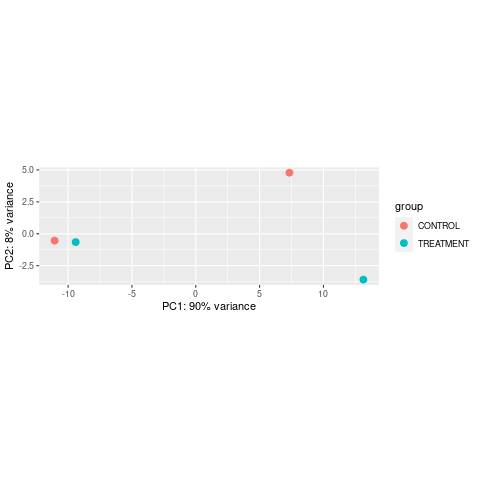
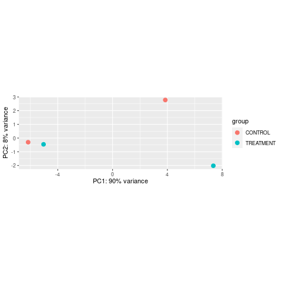
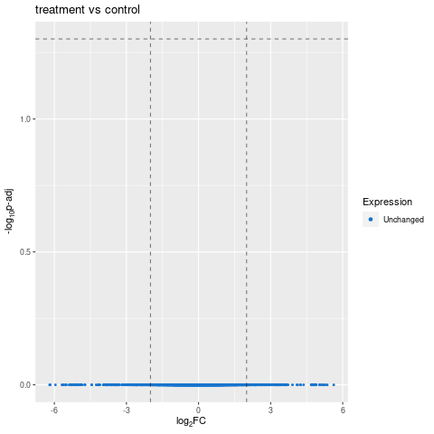
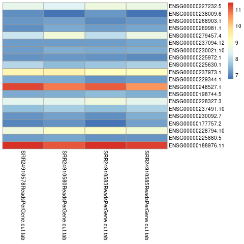

```{r setup, include=FALSE}
knitr::opts_chunk$set(echo = TRUE)
```

## Data description 
**Bioproyect:** PRJNA983389

**Species:** Homo sapiens

**Library type:** Paired-end

**Library selection:** Total RNA, cDNA

**Number of transcriptoms:** 4 

**Biological replicates:** 4 biological replicates 

**Sequencing plataform:** Illumina NovaSeq 6000 (Homo sapiens)

**Sample distribution:** 

- *Treatment:* 2 biological replicates, CAR-T cells with genetic disruption of ZFP36 (SRR24910585, SRR24910583 )

- *Control:* 2 biological replicates, CAR-T cells mock control (SRR24910578, SRR24910580)

**Sequencing depth per transcriptome:**

- SRR24910583: ~20 M read

- SRR24910585: ~30 M read

- SRR24910578: ~25 M read

- SRR24910580: ~27 M read

## Abstract
The ZFP36 is an RNA binding protein that regulates the stability of mRNAs involved in T cell inflammatory functions. In this work, we analyzed a bulk RNA-seq dataset to compare knockout (KO) of ZFP36 in CD4 CAR-T cells to unedited mock cells, this to observe if the disruption of ZFP36 could enhance antitumor responses. The programs used in this work are fastqc/multiqc, which helped in analyzing the quality of the fastq files; Trimmomatic, a bioinformatic tool used for removing bad quality sequences; STAR, which is an alignment tool; and finally R, in which we did the differential gene expression. Further analyses could not be done due to the errors in the plot generation, however, the authors didn't see a statistically significant difference between the KO and mock cells, which led to the conclusion that the sole disruption of ZFP36 is not sufficient for enhancement of the inflammatory function.

## Work directory guide
The main directory where all of our data and results are located is the following:

```
/mnt/Guanina/bioinfo24/Equipo3/Proyecto
```
 
The ```data``` directory is where all the raw data from our project are located:

```
/mnt/Guanina/bioinfo24/Equipo3/Proyecto/data
```
The ```scripts``` directory is where all the scripts that were used to send as jobs to the LAVIS cluster are stored

```
/mnt/Guanina/bioinfo24/Equipo3/Proyecto/scripts
```
 
The ```quality1``` directory contains all the fastqc reports generated for each of the fastq files from the raw data. In this case, there are 8 fastqc reports. This directory also contains the multiqc report, as well as another directory called ```multiqc_data``` that has files giving information regarding the mulitqc processing.

```
/mnt/Guanina/bioinfo24/Equipo3/Proyecto/quality1
```

The ```TRIM_results``` directory contains the trimmed files generated by the tool Trimmomatic. it contains a trimmed and an unpaired file for every fastq file, (16 files).

```
/mnt/Guanina/bioinfo24/Equipo3/Proyecto/TRIM_results
```

The ```quality2``` directory contains the same analyses as the quality1 directory, however, these quality control reports are done after the trimming was complete. Since we have 16 fastq files generated by the Trimmomatic tool, we will have 16 reports and 16 zip files generated to make the reports (32 files in total). Just like the quality1 directory, there is also a multiqc report and a directory called ```multiqc_data``` with information of the processing.

```
/mnt/Guanina/bioinfo24/Equipo3/Proyecto/quality2
```
The ```annotation``` directory has the annotation file for the reference genome. An annotation file is used to store and represent genomic information.

```
/mnt/Guanina/bioinfo24/Equipo3/Proyecto/annotation
```
```STAR_index``` has the indexing files needed for the alignment. The indexing files are used by the aligner and it is particularly useful for speeding up the process by using less computational power.
```
/mnt/Guanina/bioinfo24/Equipo3/Proyecto/STAR_index
```
```STAR_output``` has the alignment file, as well as other log files useful for debugging.
```
/mnt/Guanina/bioinfo24/Equipo3/Proyecto/STAR_output
```
The ```results``` directory has the differential gene expression results, which has 2 other directories: ```counts``` has statistics of the mapped and unmapped sequences; ```figures``` has all the images generated by R and the csv and r files.

Finally, there are two files in the general project directory: ```metadata.csv``` is a file used in the differential gene expression results, and ```TruSeq3-PE-2.fa``` is the file that contains the Illumina Adapters. Their paths are the following:
```
/mnt/Guanina/bioinfo24/Equipo3/Proyecto/metadata.csv
/mnt/Guanina/bioinfo24/Equipo3/Proyecto/TruSeq3-PE-2.fa
```

## Results


### FastQC and MultiQC raw data
To check the quality of our raw data, we first use fastqc, which gives the analyses of all the fastq files stored in the data directory. The commands were run in a qlogin session with no need of a .sge script:

```{bash, eval = FALSE}
#Módulo que usaremos
module load fastqc/0.11.3
module load multiqc/1.5

#Ciclo para hacer el QC de todos los archivos
for file in /mnt/Guanina/bioinfo24/Equipo3/Proyecto/data/*.fq.gz;
#Directorio donde se guardaran los qc
do fastqc $file -o /mnt/Guanina/bioinfo24/Equipo3/Proyecto/quality1;
done

#Comando para realizar el multiqc a partir de los fastqc generados
multiqc quality1 -o /mnt/Guanina/bioinfo24/Equipo3/Proyecto/quality1
```

Analyzing a few of the files, we can observe that the sections that gave an error were the following:

- **Per base sequence content:** The lines in he graph should be parallel. However, when dealing with RNA-seq data, this section always gives an error due to libraries produced by primers using aleatory hexamers, which give an enrichment of the initial nucleotides.

- **Sequence duplication levels:** These are sequences that are repeated several times in the analyses. It can be caused by adapter dimers. 

- **K-mer content:** This indicates a kmer enrichment, and therefore a possible bias or contamination in the samples.

This was further confirmed by the multiqc analysis.

### Trimming  
As we see in the FastQC report, the reads have a good quality in general but we had a problem with the adapter content, so it is necessary to remove those adapters and bad quality sequences to increase the quality of our data. For this we need our paired-end fastq files and adapter file (TruSeq3-PE-2.fa) and the timmomatic tool. The script we used for the trimming is the following:
```{bash, eval = FALSE}
# Modulo que usaremos:
module load trimmomatic/0.33

#Movernos a la carpeta con los datos
cd /mnt/Guanina/bioinfo24/Equipo3/Proyecto/data

#Ciclo para hacer trimming en cada par de lecturas
for i in *_1.fastq.gz;
do echo
trimmomatic PE -threads 8 -phred33 $i "${i%_1.fastq.gz}_2.fastq.gz" \
#Rutas y nombre de como se guardaran los archivos
/mnt/Guanina/bioinfo24/Equipo3/Proyecto/TRIM_results/"${i%_1.fastq.gz}_1_trimmed.fq.gz" \
/mnt/Guanina/bioinfo24/Equipo3/Proyecto/TRIM_results/"${i%_1.fastq.gz}_1_unpaired.fq.gz" \
/mnt/Guanina/bioinfo24/Equipo3/Proyecto/TRIM_results/"${i%_1.fastq.gz}_2_trimmed.fq.gz" \
/mnt/Guanina/bioinfo24/Equipo3/Proyecto/TRIM_results/"${i%_1.fastq.gz}_2_unpaired.fq.gz" \
#Archivo con adaptadores e intrucciones para el trimming
ILLUMINACLIP:/mnt/Guanina/bioinfo24/Equipo3/Proyecto/TruSeq3-PE-2.fa:2:30:10 LEADING:3 TRAILING:3 SLIDINGWINDOW:4:20 MINLEN:80 \

done

```

The files generated will be 4 per transcriptome, 2 unpaired sequences (*_unpaired.fq.gz*) and 2 paired sequences (*_trimmed.fq.gz*). The 16 files were stored in de directory ```TRIM_results```.  

### FastQC and MultiQC trimmed data
We do the same steps to generate the fastqc files as with the raw data, the only differences being that instead of the data directory, we take the fastq files from the TRIM_results directory, which has all 16 of the fastq files: 

```{bash, eval = FALSE}
#Modulo que usaremos
module load fastqc/0.11.3
module load multiqc/1.5

#Ciclo para hacer el QC de todos los archivos
for file in /mnt/Guanina/bioinfo24/Equipo3/Proyecto/TRIM_results/*.fq.gz;
#DIrecotiro donde se guardaran los qc
do fastqc $file -o /mnt/Guanina/bioinfo24/Equipo3/Proyecto/quality2;
done

multiqc quality2 -o /mnt/Guanina/bioinfo24/Equipo3/Proyecto/quality2
```
The fastqc files that are important are the trimmed ones, since these are the ones that passed the Trimmomatic filters. We can see in the multiqc that these sequences have a better quality, and therefore we will be using these trimmed sequences for the next steps.

### Alignment
Now with the trimmed sequences we can finally align our sequences to the reference genome. But first of all we need a reference genome and create its index. In the information published in GEO (accession #GSM7476036) it was used the reference genome human version of GRCh38 for the data processing, this version is available in the cluster: ```/mnt/Archives/genome/human/GRCh38/UCSC/chromosomes/```. To generate the indexing it is needed an annotation file GFF or GTF, also in the cluster: ```/mnt/Archives/genome/human/GRCh38/ensembl76/GTF-file/Homo_sapiens.GRCh38.76.gtf```.

The scripts we used for the indexing are the following:
```{bash, eval = FALSE}
# Modulo que usearemos:
module load star/2.7.9a

#Hilos de CPU utilizados
STAR --runThreadN 12 \
--runMode genomeGenerate \
#Ruta donde se guardara el index
--genomeDir /mnt/Guanina/bioinfo24/Equipo3/Proyecto/STAR_index \
#Ruta donde esta el genoma de referencia del humano (disponible en el cluster)
--genomeFastaFiles /mnt/Archives/genome/human/GRCh38/UCSC/chromosomes/ \
#Ruta del archivo de anotacion del genoma (tambien disponible en el cluster)
--sjdbGTFfile /mnt/Archives/genome/human/GRCh38/ensembl76/GTF-file/Homo_sapiens.GRCh38.76.gtf \
#Longitud minima de la secuencia de sobreposicion utilizada en el proceso de alineacion
--sjdbOverhang 149
```
The index is now in the directory ```STAR_index```, so it is time to make the alignment and count the read per gene with STAR.
```{bash, eval = FALSE}
#Modulo que usaremos
module load star/2.7.9a

index=/mnt/Guanina/bioinfo24/Equipo3/Proyecto/STAR_index
#Archivos que se alinearan
FILES=/mnt/Guanina/bioinfo24/Equipo3/Proyecto/TRIM_results/*_1_trimmed.fq.gz
for f in $FILES
do
#Extraer el nombre base del archivo
    base=$(basename $f _1_trimmed.fq.gz)
    echo $base
#Numero de hilos de CPU utilizados
    STAR --runThreadN 12 --genomeDir $index --readFilesIn $f /mnt/Guanina/bioinfo24/Equipo3/Proyecto/TRIM_results/$base"_2_trimmed.fq.gz" \
#Formato de salida del archivo SAM
    --outSAMtype BAM SortedByCoordinate \
#Cuantificacion de expresion genica
    --quantMode GeneCounts \
    --readFilesCommand zcat \
#Nombrar archivos de salida
    --outFileNamePrefix /mnt/Guanina/bioinfo24/Equipo3/Proyecto/STAR_output/$base
done

```
The generated files are now available on ```STAR_outputs``` with information about de counts. 

### Differential gene expression
For the differential gene expression analysis we need to process the counts obtained from the STAR alignment with R (we loaded the r/4.0.2 module in the cluster).

First we need to load the files:
```{r, eval = FALSE}
######
# Script : Importar datos de cuentas en R
# Author: Sofia Salazar, Diego Ramirez y Evelia Coss
# Date: 27/02/2024
# Description: El siguiente script nos permite importar los datos provenientes del alineamiento de STAR a R,
# para el posterior analisis de Expresion diferencial con DESEq2.
# Usage: Correr las lineas en un nodo de prueba en el cluster.
# Arguments:
#   - Input: metadata.csv, cuentas de STAR (Terminacion ReadsPerGene.out.tab)
#   - Output: Matriz de cuentas (CSV y RData)
#######

# --- Load data -----
# Cargar archivos
#indir <- "/mnt/Guanina/bioinfo24/data/Clase_RNASeq2024/STAR_output"
indir <- "/mnt/Guanina/bioinfo24/Equipo3/Proyecto/STAR_output/"
outdir <- "/mnt/Guanina/bioinfo24/Equipo3/Proyecto/results/"

# Opcion B -  sin movernos de carpeta
files <- dir(indir, pattern = "ReadsPerGene.out.tab")

# crear matriz de cuentas
counts <- c() # esta sera la matriz
for(i in seq_along(files)){
  x <- read.table(file = files[i], sep = "\t", header = F, as.is = T)
  # as.is para no convertir tipo de datos
  counts <- cbind(counts, x[,2])
}

# Cargar Metadatos 
metadata <- read.csv("/mnt/Guanina/bioinfo24/Equipo3/Proyecto/metadata.csv", header = F)
# Renombrar columnas en la metadata
colnames(metadata) <- c("sample_id", "type")
# Convertir a formato dataframe
counts <- as.data.frame(counts)
rownames(counts) <- x[,1] # Renombrar las filas con el nombre de los genes
colnames(counts) <- sub("_ReadsPerGene.out.tab", "", files)

# Eliminar las 4 primeras filas
counts <- counts[-c(1:4),]

# Almacenar metadata y matriz de cuentas
save(metadata, counts, file = paste0(outdir, "counts/raw_counts.RData"))
write.csv(counts, file = paste0(outdir,"counts/raw_counts.csv"))

# Guardar informacion de ejecucion
sessionInfo()
```
*The R scripts were provided in the RNA-seq course by Evelia Coss, we just modified the pathways and file names 

Then, it is necessary normalize the data to avoid technical and biological biases and visualize it:   
```{r, eval = FALSE}
######
# Script : Analisis de expresion diferencial
# Author: Sofia Salazar, Diego Ramirez y Evelia Coss
# Date: 27/02/2024
# Description: El siguiente script nos permite realiza el Analisis de expresion Diferencial
# a partir de los datos provenientes del alineamiento de STAR a R,
# Primero correr el script "load_data_inR.R"
# Usage: Correr las lineas en un nodo de prueba en el cluster.
# Arguments:
#   - Input: Cargar la variable raw_counts.RData que contiene la matriz de cuentas y la metadata
#   - Output: DEG
#######

# --- Load packages ----------
library(DESeq2)

# --- Load data -----
# Cargar archivos
outdir <- "/mnt/Guanina/bioinfo24/Equipo3/Proyecto/results/"
figdir <- '/mnt/Guanina/bioinfo24/Equipo3/Proyecto/results/figures/'

#Cargar variable "counts", proveniente del script "load_data_inR.R"
load("/mnt/Guanina/bioinfo24/Equipo3/Proyecto/results/counts/raw_counts.RData") 
samples <- metadata$sample_id # Extraer los nombres de los Transcriptomas
metadata$type <- as.factor(metadata$type) # convertir a factor

# --- DEG ----
counts <- counts[which(rowSums(counts) > 10),] #Seleccionamos genes con mas de 10 cuentas

# Convertir al formato dds
dds <- DESeqDataSetFromMatrix(countData =  counts, 
            colData = metadata, design = ~type) #Se hace un DESeqDataSet para realizar un analisis

dim(dds) # checar las dimensiones

##  -- Asignar la referencia y generar contrastes -----
# Las comparaciones se realizan por pares
#Si no se indica de manera explicita que se va a comparara, lo va a tomar de manera alfabetica, 
# en este caso se indica que control es la referencia, 
dds$type <- relevel(dds$type, ref = "CONTROL") 

## --- Obtener archivo dds ----

dds <- DESeq(dds)

# Obtener la lista de coeficientes o contrastes
resultsNames(dds)

# Guardar la salida del diseno
save(metadata, dds, file = paste0(outdir, 'dds_treatment_vs_control.RData'))

## --- Normalizacion de los datos ---------
# Opcion 1. log2(n + 1)
ntd <- normTransform(dds)

# Opcion 2. regularized logarithm or rlog
# Normalizacion de las cuentas por logaritmo y podrias hacer el analisis usando este objeto en lugar del dds
ddslog <- rlog(dds, blind = F) 

# Opcion 3. vsd
# Estima la tendencia de dispersion de los datos y calcula la varianza, hace una normalizacion de las 
# cuentas con respecto al tamaño de la libreria
vsdata <- vst(dds, blind = F) 

## --- Deteccion de batch effect ----

# Almacenar la grafica
png(file = paste0(figdir, "PCA_rlog.png"))
plt <- plotPCA(ddslog, intgroup = "type")
print(plt)
dev.off()

# Almacenar la grafica
png(file = paste0(figdir, "PCA_vsd.png"))
plt <- plotPCA(vsdata, intgroup = "type")
print(plt)
dev.off()

# Guardar la salida del diseno (vsdata)
save(metadata, vsdata, file = paste0(outdir, 'vst_treatment_vs_control.RData'))

# En la grafica de las primeras dos componentes principales son notorias las diferencias 
# entre tipos de muestras con respecto a las componente principales que capturan su varianza, 
# cada componente principal representa una combinacion lineal de las variables (en este caso genes) 
# que explican la mayor cantidad de varianza en nuestros datos (las cuentas).


## ---- Obtener informacion del contraste 1 ----
# results(dds, contrast=c("condition","treated","untreated"))
res_t <- results(dds, name = "type_TREATMENT_vs_CONTROL")
res_t

summary(res_t)

# Guardar los resultados
write.csv(res_t, file=paste0(outdir, 'DE_treatment_vs_control.csv'))

```
For the visualization:
```{r, eval = FALSE}
######
# Script : Visualizacion grafica de los resultados de DEG
# Author: Sofia Salazar, Diego Ramirez y Evelia Coss
# Date: 27/02/2024
# Description: El siguiente script nos permite realiza el Analisis de Terminos GO
# a partir de los datos provenientes del Analisis de DEG
# Primero correr el script "DEG_analysis.R"
# Usage: Correr las lineas en un nodo de prueba en el cluster.
# Arguments:
#   - Input: 
#       - dds_Times_vs_control.RData (dds), 
#       - vst_Times_vs_control.RData (vsdata) 
#       - archivos de salida de DEG en formato CSV (res_15t, res_30t, res_4t) 
#   - Output: Volcano plot y Heatmap
#######

# --- Load packages ----------
library(dplyr)
library(pheatmap)
library(ggplot2)

# --- Load data -----
# Cargar archivos
figdir <- '/mnt/Guanina/bioinfo24/Equipo3/Proyecto/results/figures/'

#Cargar variable "dds", proveniente del script "DEG_analysis.R"
load("/mnt/Guanina/bioinfo24/Equipo3/Proyecto/results/dds_treatment_vs_control.RData")

#Cargar variable "vsdata", proveniente del script "DEG_analysis.R" 
load("/mnt/Guanina/bioinfo24/Equipo3/Proyecto/results/vst_treatment_vs_control.RData") 

#Cargar variable "res_30t", proveniente del script "DEG_analysis.R"
#load("/mnt/Guanina/bioinfo24/data/Clase_RNASeq2024/results/DE_30min_vs_control.csv") 
load("/mnt/Guanina/bioinfo24/Equipo3/Proyecto/results/DE_treatment_vs_control.csv") 

# ---- volcano plot ----
df <- as.data.frame(res_t)
# padj 0.05 y log2FoldChange de 2
df <- df %>% 
  mutate(Expression = case_when(log2FoldChange >= 2 & padj < 0.05 ~ "Up-regulated",
                                log2FoldChange <= -(2) & padj < 0.05 ~ "Down-regulated",
                                TRUE ~ "Unchanged"))

# visualizacion
png(file = paste0(figdir, "VolcanoPlot_treatment_vs_control.png"))

ggplot(df, aes(log2FoldChange, -log(padj,10))) +
  geom_point(aes(color = Expression), size = 0.7) +
  labs(title = "treatment vs control") +
  xlab(expression("log"[2]*"FC")) + 
  ylab(expression("-log"[10]*"p-adj")) +
  scale_color_manual(values = c("dodgerblue3", "gray50", "firebrick3")) +
  guides(colour = guide_legend(override.aes = list(size=1.5))) +
  geom_vline(xintercept = 2, linetype = "dashed", color = "black", alpha = 0.5) +
  geom_vline(xintercept = -(2), linetype = "dashed", color = "black", alpha = 0.5) +
  geom_hline(yintercept = -log10(0.05), linetype = "dashed", color = "black", alpha = 0.5)

dev.off()

# --- Heatmap (vsd) -----
topGenes <- head(order(res_t$padj), 20) # Obtener el nombre de los 20 genes con p value mas significativo

png(file = paste0(figdir, "Heatmap_vsd_topgenes.png"))
pheatmap(assay(vsdata)[topGenes,], cluster_rows=FALSE, show_rownames=TRUE,
         cluster_cols=FALSE)
dev.off()

# --- Heatmap  (por contrastes) (log2 Fold Change) -----
betas <- coef(dds)
colnames(betas)

mat <- betas[topGenes, -c(1,2)] # crear la matriz con el topgene de genes

# Filtro de 3 log2foldchange
thr <- 1
mat[mat < -thr] <- -thr
mat[mat > thr] <- thr

# Almacenar la grafica
png(file = paste0(figdir, "Heatmap_log2FoldChage_topgenes.png"))
pheatmap(mat, breaks=seq(from=-thr, to=thr, length=101),
         cluster_col=FALSE)
dev.off()

# https://master.bioconductor.org/packages/release/workflows/vignettes/rnaseqGene/inst/doc/rnaseqGene.html#time-course-experiments
```
Functional term analysis:
```{r, eval=FALSE}
#######
# Script : Analisis de terminos GO
# Author: Sofia Salazar, Diego Ramirez y Evelia Coss
# Date: 01/03/2024
# Description: El siguiente script nos permite realiza la Determinacion funcional de los genes diferencialmente expresados
# a partir de los datos provenientes del alineamiento de STAR a R,
# Primero correr el script "load_data_inR.R"
# Usage: Correr las lineas en un nodo de prueba en el cluster.
# Arguments:
#   - Input: metadata.csv, cuentas de STAR (Terminacion ReadsPerGene.out.tab)
#   - Output: Matriz de cuentas (CSV y RData)
#######

# --- Load packages ----------
library(gprofiler2)
library(enrichplot)
library(DOSE)
library(clusterProfiler)
library(ggplot2)
library(tidyverse)
library(dplyr)

# --- Load data -----
# Cargar archivos
indir <- "/mnt/Guanina/bioinfo24/Equipo3/Proyecto/results/"
outdir <- "/mnt/Guanina/bioinfo24/Equipo3/Proyecto/results/"
figdir <- '/mnt/Guanina/bioinfo24/Equipo3/Proyecto/results/figures/'

# ---- Analisis de terminos Go ----
# Seleccionar bases de datos
sources_db <- c("GO:BP", "KEGG", "REAC", "TF", "MIRNA", "CORUM", "HP", "HPA", "WP")

# Seleccionar solo archivos CSV
files <- dir(indir, pattern = "^DE_(.+)\\.csv$") 

# ---- Ejemplo de UN SOLO ARCHIVO --------
# Extraer el nombre del primer archivo
plot_name <- gsub("^DE_(.+)\\.csv$", "\\1",  files[1]) #name

# Cargar archivo
df <- read.csv(file = paste0(indir, files[1]), row.names = 'X')
head(df)

# Agregar informacion sobre la expresion
abslogFC <- 2 # Corte de 2 log2FoldChange
df <- df %>% 
  dplyr::mutate(Expression = case_when(log2FoldChange >= abslogFC & padj < 0.05 ~ "Up-regulated",
                                       log2FoldChange <= -(abslogFC) & padj < 0.05 ~ "Down-regulated",
                                       TRUE ~ "Unchanged")) 

# Obtener los nombres de los genes
# > UP 
up_genes <- df %>% filter(Expression == 'Up-regulated') %>% 
  arrange(padj, desc(abs(log2FoldChange)))
# Extraer solo el nombre de los genes
up_genes <- rownames(up_genes) 

head(up_genes)

# > Down
down_genes <- df %>% filter(Expression == 'Down-regulated') %>% 
  arrange(padj, desc(abs(log2FoldChange)))
# Extraer solo el nombre de los genes
down_genes <- rownames(down_genes) 

head(down_genes)

# 
multi_gp <- gost(list("Upregulated" = up_genes, 
                      "Downregulated" = down_genes), 
                 correction_method = "fdr", user_threshold = 0.05,
                 multi_query = F, ordered_query = T, 
                 sources = sources_db, 
                 evcodes = TRUE,  # intersection = intersection - a comma separated list of genes 
                 # from the query that are annotated to the corresponding term
                 organism = 'hsapiens') # para humano es hsapiens

## ---- colors ---
# paleta de colores
Category_colors <- data.frame(
  category = c("GO:BP", "GO:CC", "GO:MF", "KEGG",
               'REAC', 'TF', 'MIRNA', 'HPA', 'CORUM', 'HP', 'WP'), 
  label = c('Biological Process', 'Cellular Component', 'Molecular Function',  "KEGG",
            'REAC', 'TF', 'MIRNA', 'HPA', 'CORUM', 'HP', 'WP'),
  colors =  c('#FF9900', '#109618','#DC3912', '#DD4477',
              '#3366CC','#5574A6', '#22AA99', '#6633CC', '#66AA00', '#990099', '#0099C6'))

## ----manhattan plot--------
gostp1 <- gostplot(multi_gp, interactive = FALSE)

# Guardar grafica
ggsave(paste0(figdir, "ManhattanGO_", plot_name, ".png"),
       plot = gostp1, dpi = 300)

## ----Dataframe de todos los datos --------
# Convertir a dataframe
gost_query <- as.data.frame(multi_gp$result)

# Extarer informacion en modo matriz de todos los resultados
bar_data <- data.frame("term" = as.factor(gost_query$term_name), "condition" = gost_query$query, 
                       "count" = gost_query$term_size, "p.adjust" = gost_query$p_value, 
                       'category' = as.factor(gost_query$source), "go_id" = as.factor(gost_query$term_id),
                       'geneNames' = gost_query$intersection
)


## ---- DOWN genes ----
bar_data_down <- subset(bar_data, condition == 'Downregulated')

# Ordenar datos y seleccion por pvalue
bar_data_down <-head(bar_data_down[order(bar_data_down$p.adjust),],40) # order by pvalue
bar_data_down_ordered <- bar_data_down[order(bar_data_down$p.adjust),] # order by pvalue
bar_data_down_ordered<- bar_data_down_ordered[order(bar_data_down_ordered$category),] # order by category
bar_data_down_ordered$p.val <- round(-log10(bar_data_down_ordered$p.adjust), 2)
bar_data_down_ordered$num <- seq(1:nrow(bar_data_down_ordered)) # num category for plot

# Guardar dataset
save(bar_data_down_ordered, file = paste0(outdir, "DOWN_GO_", plot_name, ".RData"))

# agregar colores para la grafica
bar_data_down_ordered_mod <- left_join(bar_data_down_ordered, Category_colors, by= "category")

### ---- DOWN genes (barplot) ----
# Generar la grafica
g.down <- ggplot(bar_data_down_ordered_mod, aes(p.val, reorder(term, -num), fill = category)) +
  geom_bar(stat = "identity") +
  geom_text(
    aes(label = p.val),
    color = "black",
    hjust = 0,
    size = 2.2,
    position = position_dodge(0)
  ) +
  labs(x = "-log10(p-value)" , y = NULL) +
  scale_fill_manual(name='Category', 
                    labels = unique(bar_data_down_ordered_mod$label), 
                    values = unique(bar_data_down_ordered_mod$colors)) +
  theme(
    legend.position = "right",
    axis.title.y = element_blank(),
    strip.text.x = element_text(size = 11, face = "bold"),
    strip.background = element_blank()
  )+ theme_classic()


# Guardar la figura
ggsave(paste0(figdir,"barplotDOWN_GO_", plot_name, ".png"),
       plot = g.down + theme_classic(), dpi = 600, width = 10, height = 5)


## ---- UP genes ----
bar_data_up <- subset(bar_data, condition == 'Upregulated')

# Ordenar datos y seleccion por pvalue
bar_data_up <-head(bar_data_up[order(bar_data_up$p.adjust),],40) # order by pvalue
bar_data_up_ordered <- bar_data_up[order(bar_data_up$p.adjust),] # order by pvalue
bar_data_up_ordered<- bar_data_up_ordered[order(bar_data_up_ordered$category),] # order by category
bar_data_up_ordered$p.val <- round(-log10(bar_data_up_ordered$p.adjust), 2)
bar_data_up_ordered$num <- seq(1:nrow(bar_data_up_ordered)) # num category for plot

# Guardar dataset
save(bar_data_up_ordered, file = paste0(outdir, "UP_GO_", plot_name, ".RData"))

# agregar colores para la grafica
bar_data_up_ordered_mod <- left_join(bar_data_up_ordered, Category_colors, by= "category")

### ---- UP genes (barplot) ----
# Generar la grafica
g.up <- ggplot(bar_data_up_ordered_mod, aes(p.val, reorder(term, -num), fill = category)) +
  geom_bar(stat = "identity") +
  geom_text(
    aes(label = p.val),
    color = "black",
    hjust = 0,
    size = 2.2,
    position = position_dodge(0)
  ) +
  labs(x = "-log10(p-value)" , y = NULL) +
  scale_fill_manual(name='Category', 
                    labels = unique(bar_data_up_ordered_mod$label), 
                    values = unique(bar_data_up_ordered_mod$colors)) +
  theme(
    legend.position = "right",
    # panel.grid = element_blank(),
    # axis.text.x = element_blank(),
    # axis.ticks = element_blank(),
    axis.title.y = element_blank(),
    strip.text.x = element_text(size = 11, face = "bold"),
    strip.background = element_blank() 
  ) + theme_classic()

# Guardar la figura
ggsave(paste0(figdir, "barplotUP_GO_", plot_name, ".png"),
       plot = g.up + theme_classic(), dpi = 600, width = 10, height = 5)

```
All these figures were stored in the directory ```results/figures/``` and also you can find them in this report in the *Graphs* section.

PCA clustering (**Fig. 1** and **Fig.2**) did not reveal a notable pattern between treatment and control and showed that most of the variance among samples was due to biological differences between the donors.

We were not able to produce some figures because of the variable "*res_t*", as that gave us percentages of 0%. As we can see in the **Fig.3**, there are not genes that are statistically significant, this may be due to problems with the data processing or with the code we used. Also, we could not produce all the figures in the GO terms analysis. 

## Discussion 
In the original article we obtained similar PCA, but due to the errors we had in the making of the volcano plots we couldn’t generate this figure correctly. However, the article states that there is no statistically significant difference between the gene expression KO and mock cells, which led to the conclusion that the sole disruption of ZFP36 is insufficient for enhancement of the inflammatory function. 

## Graphs


**Fig.1.** vsd PCA 


**Fig.2.** rlog PCA


**Fig.3.** Volcano plot

**Fig.4.** Heatmap 

## References

- Mai, D., Boyce, T., Mehta, A. et al. ZFP36 disruption is insufficient to enhance the function of mesothelin-targeting human CAR-T cells. Sci Rep 14, 3113 (2024). https://doi.org/10.1038/s41598-024-53769-8

